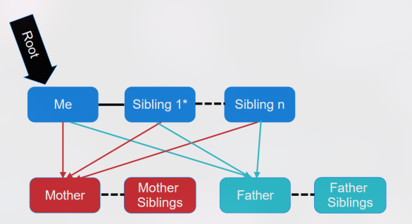

# 🌳 Árvore Genealógica de Antecessores

## 📌 Descrição do Projeto

Este projeto consiste na implementação de uma **árvore genealógica de antecessores**, onde um indivíduo (definido como raiz) possui ligações com seus **pais**, e não com seus filhos.

A estrutura permite expandir a árvore indefinidamente (limitada apenas pela memória), incluindo pais, avós, bisavós, além de irmãos em diferentes níveis.

---

## 🧩 Estrutura da Árvore

- A árvore é do tipo **N-ária**.
- Cada nó representa um indivíduo.
- A árvore cresce no sentido dos **antecessores (pais)**.

---

## 👤 Estrutura do Nó (Node)

Cada indivíduo deve conter os seguintes atributos:

- **Nome**
- **Sobrenome**
- **Data de nascimento**
- **Pai**
- **Mãe**
- **Irmãos** (lista de indivíduos)

> 🔧 Você pode adicionar outros atributos, caso julgue necessário para a implementação.

---

## ⚙️ Funcionalidades Obrigatórias

O sistema deve implementar as seguintes operações:

- ✅ Inserir um indivíduo
  - Especificando se ele será:
    - Pai
    - Mãe
    - Irmão

- 🌳 Imprimir toda a árvore genealógica

- 🔍 Buscar um familiar

- 👨 Inserir pai de um indivíduo

- 👩 Inserir mãe de um indivíduo

---

## 📈 Regras Importantes

- A árvore **não armazena filhos**, apenas os **pais**.
- Um indivíduo pode ter:
  - Nenhum irmão
  - Um ou mais irmãos
  - Irmãos com os mesmos pais ou diferentes
- A árvore pode crescer indefinidamente (enquanto houver memória disponível).
- Pais também podem ter seus próprios pais e irmãos, formando múltiplos níveis.

---

## 💻 Linguagem

- O projeto pode ser desenvolvido em:
  - **C**
  - **C++** *(recomendado devido ao uso de strings)*

---

## 📦 Entrega

- 📅 Data: **08/04**
- 📌 Entregar:
  - Código-fonte completo
  - Apresentação do funcionamento

> ❌ Não é necessário relatório.

---

## 🖼️ Exemplo

A estrutura da árvore segue o modelo apresentado na imagem fornecida (`ex1.png`).

---

## 🚀 Objetivo

Praticar:

- Estruturas de dados (árvores N-árias)
- Manipulação de ponteiros/referências
- Organização de dados hierárquicos

---

Boa implementação! 💡
